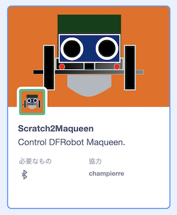

# dochi

With dochi, you can control [Dochi Robot](https://syrobot.co.kr)

[dochi Website]((https://syrobot.co.kr/))

## Usage

### Setup

1. You need the special hex file to be downloaded to your micro:bit. Open the MakeCode project below, then click Download to install the .hex file.

    &raquo;[MakeCode project:dochi_0_0_2](https://makecode.microbit.org/_D6yYw7AxcUV2))

2. Open [https://champierre.github.io/scratch3/](https://champierre.github.io/scratch3/).

3. Open "Choose an Extension" window and select "dochi".

    

4. Run [Scratch Link](https://scratch.mit.edu/microbit), then connect to the micro:bit set on Maqueen.

5. After you connect to the micro:bit, you need to calibrate the micro:bit compass. ([Calibrating the micro:bit Compass](https://support.microbit.org/support/solutions/articles/19000008874-calibrating-the-micro-bit-compass))
